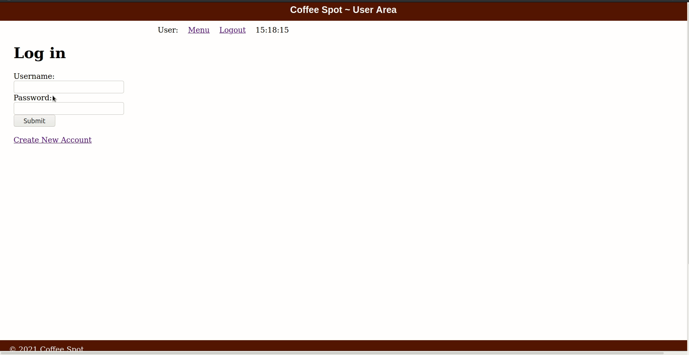

## Coffee Spot

- This project solves the problem of waiting time in a Coffee
Shop.
- Helps users in finding and reserving a vacant spot for a
while to take a seat and have coffee.
- Users have to pay a minimal reservation fee for average
stay time during booking to avoid misuse.
- Users can order a coffee from the given menu, after
entering the shop. Displays the expected waiting time if
ordered a coffee.
- Coffee orders will be updated in Chef’s order table and
will be prioritized such that it minimizes the average
waiting time of the customer.
- Displays the trending coffee in the UI.
- Users can extend their stay time. However, the
extended-stay time incurs additional charges.
- Reserved spot deallocates after the deadline and marks the
current spot as available.
- We limit the number of booking spots per user in a constant
period to avoid misuse
